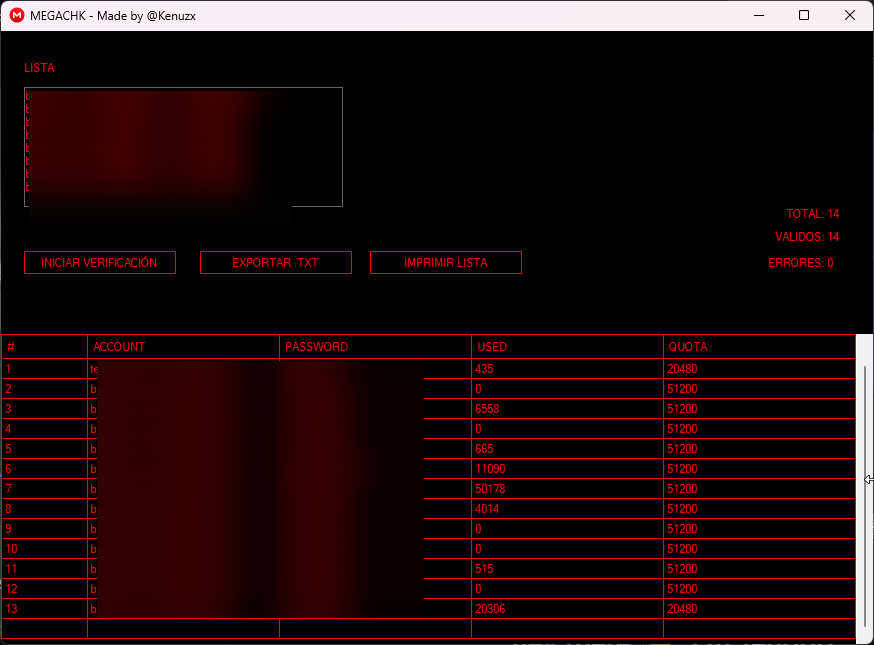

# MegaChk

## Descripción

**MegaChk** es una herramienta simple para validar y verificar información de cuentas de Mega. La aplicación permite cargar listas de credenciales, procesarlas y exportar los resultados verificados.

## Características

- ✅ Importación de listas de credenciales (formato: email:password)
- ✅ Verificación automática de cuentas Mega
- ✅ Obtención de información de cuota (usada/total)
- ✅ Procesamiento concurrente de múltiples cuentas
- ✅ Exportación de resultados a archivos TXT
- ✅ Interfaz gráfica intuitiva con Windows Forms
- ✅ Contadores en tiempo real (total, válidos, errores)
- ✅ Guardado automático de cuentas válidas

## Uso Básico

1. Abrir la aplicación
2. Pegar lista de credenciales en el formato: email:password
3. Hacer clic en "Iniciar" para verificar cuentas
4. Exportar resultados usando "Exportar a TXT"

## ⚠️ Advertencias

**ESTA ES UNA HERRAMIENTA EDUCATIVA**

- ⚠️ **Solo para uso educativo y de investigación**
- ⚠️ Respeta los términos de servicio de Mega
- ⚠️ No uses esta herramienta para acceder a cuentas sin autorización
- ⚠️ El uso no autorizado de credenciales ajenas es ilegal
- ⚠️ Asume toda responsabilidad sobre cómo uses esta herramienta

## 📋 Disclaimer Legal

El autor de este proyecto **no se hace responsable** por:

- Cualquier uso indebido de esta herramienta
- Acceso no autorizado a cuentas de terceros
- Daños legales o administrativos derivados de su uso
- Pérdida de datos o información
- Violación de términos de servicio de plataformas

**Esta herramienta se proporciona tal cual, solo con fines educativos.**

## Requisitos Técnicos

- .NET Framework 4.8+
- Windows Forms
- Conexión a Internet
- Librería: CG.Web.MegaApiClient

## Archivos Generados

- alids.txt - Contiene cuentas válidas verificadas

---

**Desarrollado solo con propósitos educativos.**
